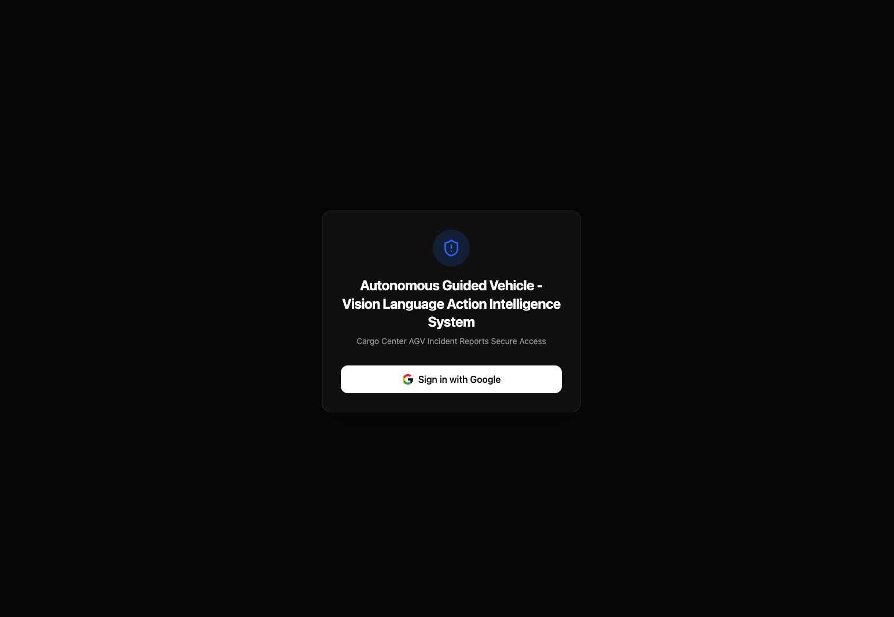
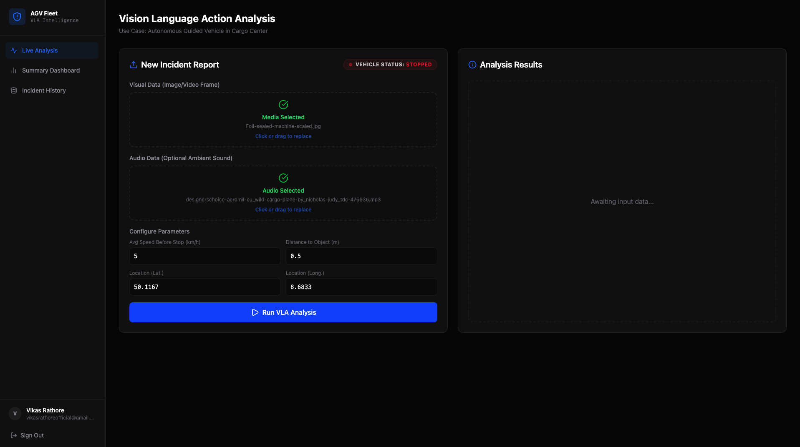
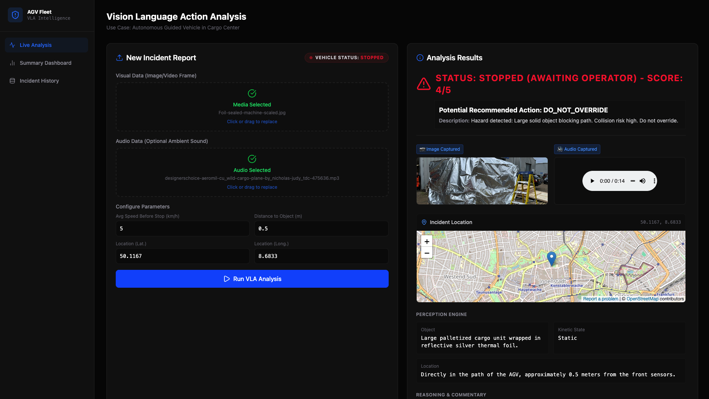
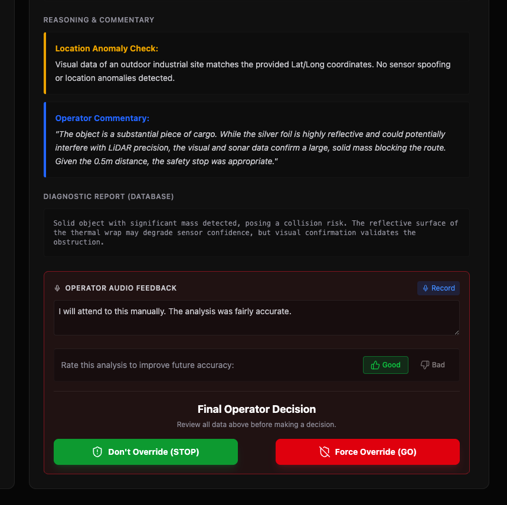
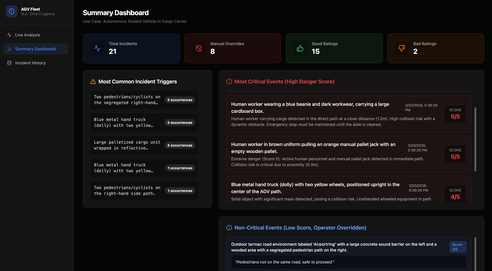
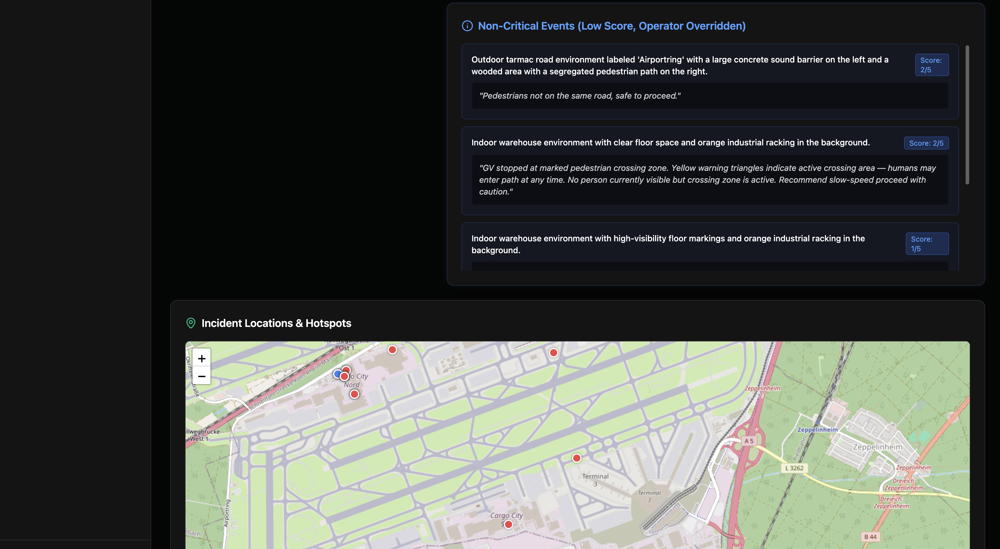
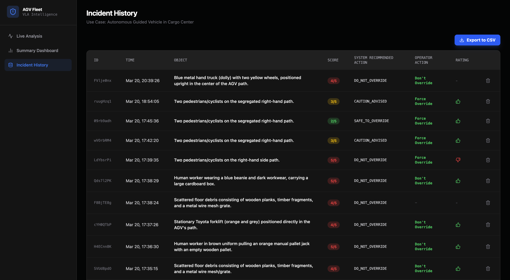

# App Screenshot Gallery

This page renders the supporting UI evidence referenced by the application functionality report in [`../../3_Functional_Diagram/VLA-1 Rat Kho Application Functionality Report.md`](../../3_Functional_Diagram/VLA-1%20Rat%20Kho%20Application%20Functionality%20Report.md). The PNG files in this folder are kept in a fixed order so the application's implemented workflow can be reviewed visually.

## 1. Sign In

Operator authentication screen using Google Sign-In before dashboard access.

## 2. Live Analysis

Live Analysis workspace showing the new incident report form and the empty analysis-results panel.

## 3. Manual Parameter Input

Manual telemetry entry in the prototype; in a production deployment these fields would be pre-populated by an AGV API or telemetry stream.

## 4. Analysis Result: Header

Structured advisory output with operator-facing status, danger score, and recommended action.

## 5. Analysis Result: Context

Detailed analysis context combining map location, perception output, and reasoning commentary.

## 6. Analysis Result: Operator Decision

Human-in-the-loop operator controls for feedback, stop confirmation, or forced override.

## 7. Dashboard: Summary Top

Summary Dashboard KPIs and high-severity incident overview for rapid operational review.

## 8. Dashboard: Hotspots

Lower Summary Dashboard view highlighting low-severity overrides and mapped incident hotspots.

## 9. Incident History

Historical incident log with system recommendation, operator action, rating, and CSV export support.

